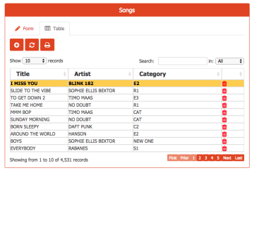
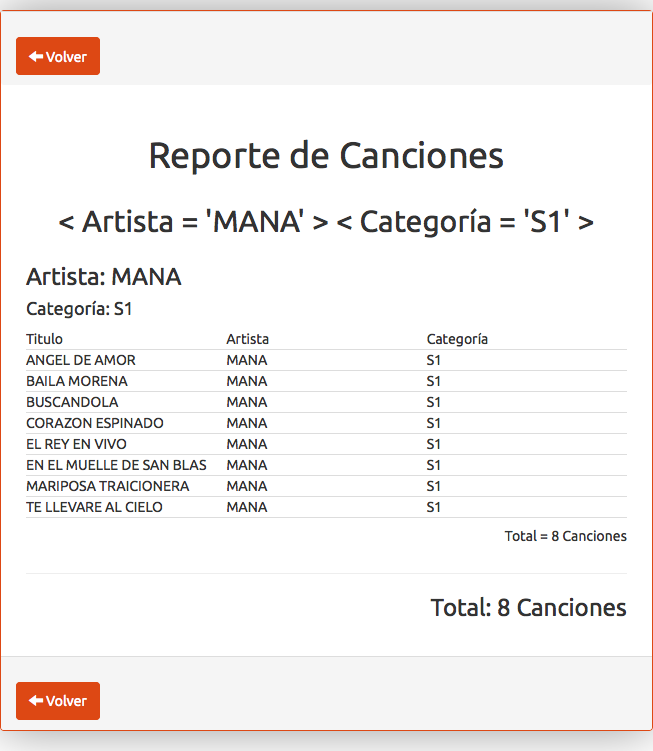

 ## **Yupii** is a package that transforms CodeIgniter into a Business Application Framework !!

hint: With Yupii you will have **automatic CRUD**, **automatic relations** between catalogs, and **automatic report generation**, all this **with just a few lines of code**

**Yupii** is:

- easy to [install](install.md) 
- easy to [use](quickstart.md) 
- **multilanguage**
- **responsive design** that plays nice with mobile devices.
- and you can adjust the design to your projects, creating your own **themes** or using the free ones of http://bootswatch.com/  

Spend more time at the beach and less time developing applications; with **Yupii** you just need to declare *"what you need"*, and the framework takes care of the *"how to do it"*

**Yupii** is a truly Object-Oriented solution that helps you to reuse and simplify your code, and allows you to *create entire business applications in the blink of an eye*.

<form style="display: inline-block;float: right; background-color: beige; border-radius:15px; padding:10px;" action="https://www.paypal.com/cgi-bin/webscr" method="post" target="_top">
Contribute to this project
<input type="hidden" name="cmd" value="_s-xclick">
<input type="hidden" name="hosted_button_id" value="SLHMD6D3XMM3C">
<input type="image" src="https://www.paypalobjects.com/en_US/i/btn/btn_donateCC_LG.gif" border="0" name="submit" alt="PayPal - The safer, easier way to pay online!">

</form>

**ScreenCast - Installation and first application**

Learn how to install Yupii and develop your first application in just 20 min with this video tutorial:

Checkout more video tutorials in the [videos](videos.md) section

[gimmick:FacebookLike ( layout: 'standard', showfaces: false) ](https://github.com/cgarciagl/Yupii)

[gimmick:TwitterFollow](@cgarciagl)

