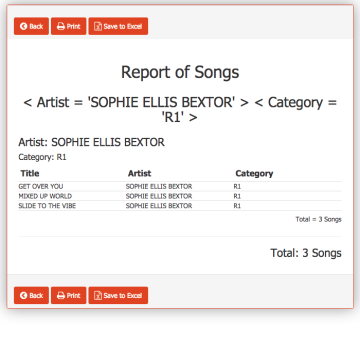

 ## **Yupii** is a package that transforms CodeIgniter into a Business Application Framework !!

hint: With Yupii you will have **automatic CRUD**, **automatic relations** between catalogs, and **automatic report generation**, all this **with just a few lines of code**

**Yupii** is:

- easy to [install](install.md) 
- easy to [use](quickstart.md) 
- **multilanguage**
- **responsive design** that plays nice with mobile devices.
- and you can adjust the design to your projects, creating your own **themes** or using the free ones of http://bootswatch.com/  

Spend more time at the beach and less time developing applications; with **Yupii** you just need to declare *"what you need"*, and the framework takes care of the *"how to do it"*

**Yupii** is a truly Object-Oriented solution that helps you to reuse and simplify your code, and allows you to *create entire business applications in the blink of an eye*.

[gimmick:FacebookLike ( layout: 'standard', showfaces: false) ](https://github.com/cgarciagl/Yupii)

[gimmick:TwitterFollow](@cgarciagl)

