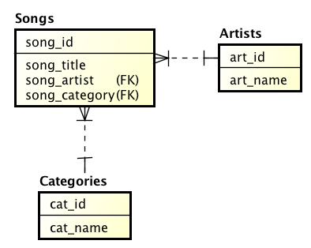

## Database Model

In this example we will code the required classes for an application that manages a songs inventory,
we have a **songs** table and a related **category** table, where each song belongs to a single category,
and a song is played for a single **artist**.



SQL script for this example is available [here](./songs.zip)

Here we will assume that you have installed CodeIgniter and [installed Yupii](install.md) and you have configured your database settings properly.

## Implementing Artists

Lets start with the first table, creating a file artists.php as a controller:

```php
<?php

class Artists extends YDatasetController {

    function __construct() {
        parent::__construct();
        $this->setTitle('Artists');
        $this->setTableName('artists');
        $this->setIdField('art_id');
        $this->addField('art_name', array('label' => 'Name', 'rules' => 'required'));
    }

}
```

attention: then you can access your controller for this table like [here](http://analisis911.aexiuv.com/index.php/artists)

## Implementing Categories

Now we'll declare the next catalog class, the controller for the Categories of songs:

```php
<?php

class Categories extends YDatasetController {

    function __construct() {
        parent::__construct();
        $this->setTitle('Categories');
        $this->setTableName('categories');
        $this->setIdField('cat_id');
        $this->addField('cat_name', array('label' => 'Category', 'rules' => 'required|is_unique'));
    }

}
```

With just this lines of code we have the manager for the table, and as you can see you can't leave blank the name of the category or use the name from another category again.

attention: the result will be something like [this](https://analisis911.aexiuv.com/index.php/categories)

## Implementing Songs

Finally we will declare a new controller for the songs table, this way:

```php
<?php

class Songs extends YDatasetController {

    function __construct() {
        parent::__construct();
        $this->setTitle('Songs');

        $this->setTableName('songs');
        $this->setIdField('song_id');

        $this->addField('song_title', array('label' => 'Title', 'rules' => 'required'));

        $this->addField('song_artist', array('label' => 'Artist'));
        $this->addSearch('song_artist', 'Artists');

        $this->addField('song_category', array('label' => 'Category', 'rules' => 'required'));
        $this->addSearch('song_category', 'Categories');
    }

}
```

attention: You can view this example functioning [here](http://analisis911.aexiuv.com/index.php/songs)

Yupii can figure it out the relations between the tables when you use the _addSearch()_ function, the first parameter is the field in the current table and the second one is the class of the asociated controller that manages the related table; just that simple!!!.

Wanna get amazed!!???, click in the printer button of this catalog and check it out the amount of reports that **Yupii** got for you by magic!! or Try it [here](http://analisis911.aexiuv.com/index.php/songs/report)

## Extending Songs Class

We can even extend the last class _adding new business rules_ using some of the magic methods that includes **Yupii**

```php
<?php

include(APPPATH . '/controllers/Songs.php');

class Eminemsongs extends Songs {

    function __construct() {
        parent::__construct();
        $this->setTitle('Eminem Songs');
    }

    function _filters() {
        parent::filters();
        $this->db->where('art_name', 'EMINEM');
    }

    function _beforeDelete() {
        parent::_beforeDelete();
        raise('You cant delete this song');
    }

    function _JustEminemSongs() {
        if (new_value('song_artist') != 'EMINEM') {
            raise('You must assign EMINEM to Artist for this song');
        }
    }

    function _beforeInsert($a) {
        parent::_beforeInsert($a);
        $this->_JustEminemSongs();
    }

    function _beforeUpdate($a) {
        parent::_beforeUpdate($a);
        $this->_JustEminemSongs();
    }

}
```

We added a couple of rules here

- Just songs from the artist EMINEM are showed,
- Another rule here is that you can't delete songs, when you try it, you get a nice error message.
- When you try to add a song or modify one of the existents, the artist for this song should be EMINEM, or you will get another error message.

attention: Go, Try it live [here](http://analisis911.aexiuv.com/index.php/eminemsongs)

## Try it

Come on, Try this example for yourself!!, you will get amazed for the simplicity in the code and the great functionality of the automagic of **Yupii**

This is just the beginning **Yupii** includes lots of functions of javascript and php methods that will make your development so much simpler and funny than ever.

<script>
$(function() {
 $(document.links).filter(function() {
     return this.hostname != window.location.hostname;
 }).attr('target', '_blank');
 });
</script>
